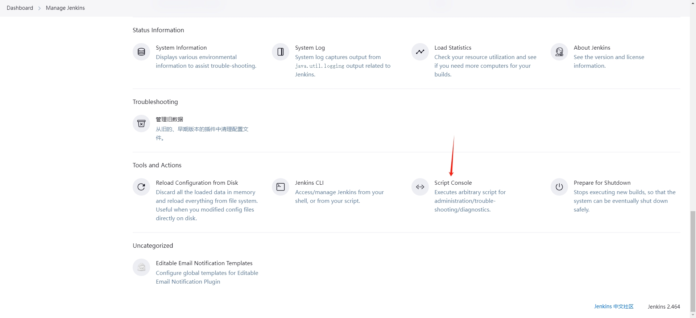
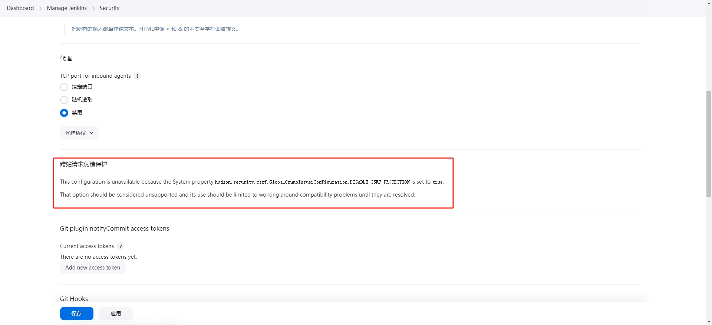

# Jenkins 2.464

Jenkins API总共有三种格式，分别为：JSON API、XML API、Python API。

> 以下使用的xml配置模版来自`http://172.17.17.231:8080/job/jobname/config.xml`，而不是`http://172.17.17.231:8080/job/jobname/api/xml`

1. 视图操作
2. 任务操作
3. 构建编译操作
4. 密钥管理
5. 状态，插件，节点管理

在SDK中 JenkinsServer是对JenkinsHttpClient某些功能的更高层次的封装，JenkinsServer依赖于JenkinsHttpClient。

## 常见问题

### Jenkins 远程触发 403 No valid crumb was included in the request

解决办法：

Manage Jenkins -> Script Console，脚本命令行输入`hudson.security.csrf.GlobalCrumbIssuerConfiguration.DISABLE_CSRF_PROTECTION = true`

