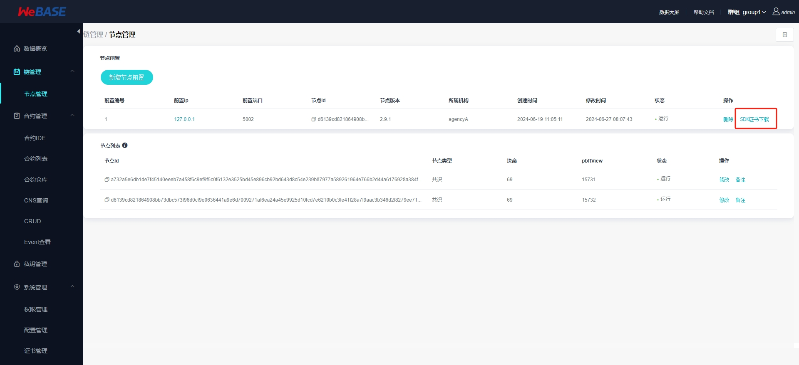

# Spring Boot整合java-sdk调用Fisco Bcos区块链

## 1. 环境说明

Fisco Bcos使用WeBASE一键搭建，参考地址：https://webasedoc.readthedocs.io/zh-cn/lab/docs/WeBASE/install.html

版本说明：https://fisco-bcos-documentation.readthedocs.io/zh-cn/latest/docs/compatibility.html

## 2. 配置环境

先把Fisco Bcos的密钥复制到resource下的conf文件

Fisco Bcos密钥文件地址为: `nodes/{ip}/sdk/*`下的所有文件，复制完成后就可以进行下一步

## 3. 调用合约

### 3.1 编写合约

### 3.2 部署合约

### 3.3 合约编译成java文件

### 3.4 使用合约代码

访问地址：http://127.0.0.1:8080/swagger-ui.html【无认证】