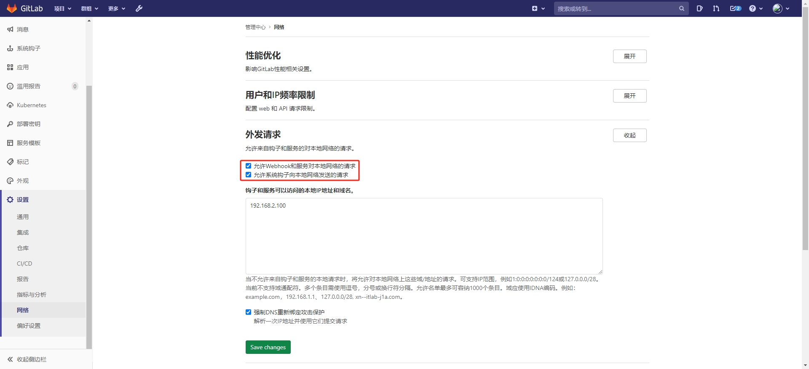
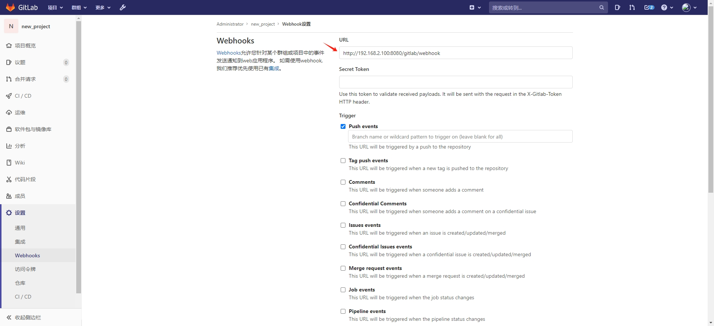

# GitLab Community Edition 13.7.4

## API代码示例

查询所有仓库

查询归属自己仓库

查询星标仓库

查询项目成员

查询项目用户

创建仓库

修改仓库

删除仓库

仓库归档

解除归档

按照项目编号或者项目路径，查询仓库成员代码修改量

```bash
# git客户端进入项目文件夹，统计特定时间段内，由指定作者所做的代码更改的统计数据
git log --since='2024-11-14 09:00:00' --until='2024-11-14 23:59:59'  --author="xzh"  --pretty=tformat: --numstat | awk '{ add += $1; subs += $2; loc += $1 - $2 } END { printf "增加数: %s, 删除的行数: %s, 净增加行数: %s\n", add, subs, loc }'
```

## 开启Webhook

gitlab 10.6 版本以后为了安全，默认不允许向本地网络发送webhook请求，以管理员身份登录开启限制



项目配置webhook请求地址



## 更多API查看源码

- org.gitlab4j.api.ProjectApi
- org.gitlab4j.api.UserApi
- org.gitlab4j.api.RepositoryApi
- org.gitlab4j.api.GroupApi
- org.gitlab4j.api.PipelineApi
- org.gitlab4j.api.LabelsApi
- org.gitlab4j.api.ReleasesApi
- org.gitlab4j.api.TagsApi
- org.gitlab4j.api.TopicsApi