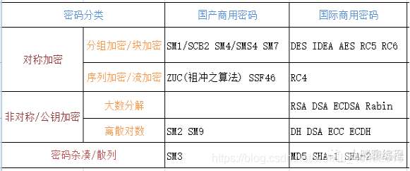

# Jasypt

官方地址：http://www.jasypt.org/

Jasypt（Java Simplified Encryption）是一个Java库，用于简化加密操作。它提供了一种简单的方式来在Java应用程序中执行加密和解密操作。使用SM4实现自定义解密器。

国密算法：即国家商用密码算法。是由国家密码管理局认定和公布的密码算法标准及其应用规范，其中部分密码算法已经成为国际标准，如SM系列密码。

SM：代表商密，即商业密码，是指用于商业的、不涉及国家秘密的密码技术。




访问地址：http://127.0.0.1:8080/doc.html 


```bash
mvn clean compile
mvn clean package
```