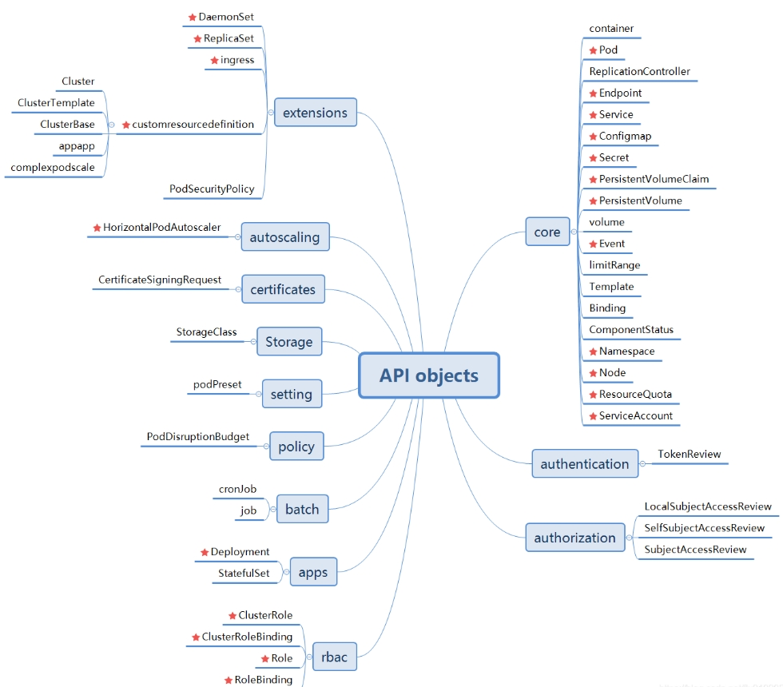

# 使用 Java 操作 Kubernetes API

Java操作k8s，开源版本共有两个：
 - kubernetes-client/java
 - fabric8io/kubernetes-client

|                             | 和官网API一致性                             | 社区活跃度             | 代码生成                                                     |
| --------------------------- | ------------------------------------------- | ---------------------- | ------------------------------------------------------------ |
| kubernetes-client/java      | 根据k8s-openapi随之更新，一致性和更新频率高 | 目前不活跃             | kubernetes-client/java提供了生成代码的通用跨语言工具，该工具托管在 kubernetes-client/gen存储库中 |
| fabric8io/kubernetes-client | 一致性低，更新慢；其中不支持k8s1.8和1.13    | 社区活跃，目前使用者多 | 暂无                                                         |

API Object 整体划分图 (红星符号代表常用资源)

## 1. kubernetes-client

### 1.1 客户端兼容性

本次测试环境使用的是v1.19.4

| client version | 1.16 | 1.17 | 1.18 | 1.19 | 1.20 | 1.21 | 1.22 | 1.23 | 1.24 | 1.25 | 1.26 | 1.27 | 1.28 | 1.29 | 1.30 |
| -------------- | ---- | ---- | ---- | ---- | ---- | ---- | ---- | ---- | ---- | ---- | ---- | ---- | ---- | ---- | ---- |
| 8.0.x          | ✓    | -    | -    | x    | x    | x    | x    | x    | x    | x    | x    | x    | x    | -    | -    |
| 9.0.x          | +    | ✓    | -    | -    | x    | x    | x    | x    | x    | x    | x    | x    | x    | -    | -    |
| 10.0.x         | +    | +    | ✓    | -    | -    | x    | x    | x    | x    | x    | x    | x    | x    | -    | -    |
| 11.0.x         | +    | +    | +    | ✓    | -    | -    | x    | x    | x    | x    | x    | x    | x    | -    | -    |
| 12.0.x         | +    | +    | +    | +    | ✓    | -    | -    | x    | x    | x    | x    | x    | x    | -    | -    |
| 13.0.x         | +    | +    | +    | +    | ✓    | !    | -    | -    | x    | x    | x    | x    | x    | -    | -    |
| 14.0.x         | +    | +    | +    | +    | +    | +    | ✓    | -    | -    | x    | x    | x    | x    | -    | -    |
| 15.0.x         | +    | +    | +    | +    | +    | +    | +    | ✓    | -    | -    | x    | x    | x    | -    | -    |
| 16.0.x         | +    | +    | +    | +    | +    | +    | +    | +    | ✓    | -    | -    | x    | x    | -    | -    |
| 17.0.x         | +    | +    | +    | +    | +    | +    | +    | +    | +    | ✓    | -    | -    | x    | -    | -    |
| 18.0.x         | +    | +    | +    | +    | +    | +    | +    | +    | +    | +    | ✓    | -    | -    | -    | -    |
| 19.0.x         | +    | +    | +    | +    | +    | +    | +    | +    | +    | +    | +    | ✓    | -    | -    | -    |
| 20.0.x*        | +    | +    | +    | +    | +    | +    | +    | +    | +    | +    | +    | +    | ✓    | -    | -    |
| 21.0.x*        | +    | +    | +    | +    | +    | +    | +    | +    | +    | +    | +    | +    | +    | +    | ✓    |
| HEAD           | +    | +    | +    | +    | +    | +    | +    | +    | +    | +    | +    | +    | +    | +    | ✓    |

说明：
-  `✓` java-client 和 Kubernetes 版本中的功能/API 对象完全相同。
-  `+` java-client 具有 Kubernetes 集群中可能不存在的功能或 api 对象，但它们的所有共同点都可以起作用。
-  `-` Kubernetes 集群具有 java-client 库无法使用的功能（附加 API 对象等）。
-  `x` Kubernetes 集群不保证支持此版本的 API 客户端，因为它仅承诺支持n -2 版本。它未经测试，使用在更高服务器版本中已弃用和删除的 API 版本的操作将无法正常运行。
-  `!` 流程中出现错误，并且13.0.0是基于 Kubernetes 的，1.20而不是1.21它应有的。
-  `* legacy`包括当前版本和

### 1.2 核心API

#### 1.2.1 AppsV1Api

AppsV1Api 是 Kubernetes 官方客户端库中的一个 API 类，它提供了与 Kubernetes 集群中 apps/v1 API 版本交互的方法和接口。这个 API 对象主要用于操作和管理 Kubernetes 中的应用程序资源，主要包括以下几种核心资源类型：

- Deployment：用于定义、更新和回滚应用实例的副本集数量及配置。
- DaemonSet：确保在每个节点上仅运行一个副本或者每个节点上都有一个副本的服务。
- StatefulSet：用于有序部署和扩展有状态应用，例如数据库集群等需要持久存储和固定标识的应用实例。
- ReplicaSet：是 Deployment 的内部实现机制，用来保证指定数量的 Pod 副本正常运行。

#### 1.2.2 BatchV1Api

BatchV1Api 是 Kubernetes API 中的一个接口，用于与 batch/v1 版本的批处理相关资源进行交互。这个版本的 API 主要提供了对批处理工作负载的支持，其中核心资源类型包括：

- Jobs：Jobs 是一次性任务，保证指定数量的任务 Pod 成功完成（即使在某些 Pod 失败的情况下）。当所有 Pods 都成功运行或者达到最大重试次数后，Job 将停止创建新的 Pods。
- CronJobs：CronJobs 是基于时间调度的工作负载，可以根据 Cron 表达式定期启动 Jobs。它主要用于执行周期性或定时任务。
#### 1.2.3 CoreV1Api

CoreV1Api 是 Kubernetes 官方客户端库中用于与 core/v1 版本的 Kubernetes API 进行交互的一个关键接口。这个版本的 API 包含了 Kubernetes 集群中最基础、最核心的一系列资源对象，包括但不限于：
- Pods：定义单个容器或一组容器及其运行时配置（如镜像、环境变量、命令、端口映射等）。作为 Kubernetes 最小的可部署单元，Pods 是容器的直接运行载体。
- Services：提供一个稳定的网络标识符（DNS 名称）和负载均衡能力，将流量转发到后端关联的一组 Pods 上。支持多种类型的访问策略，例如 ClusterIP（集群内部访问）、NodePort（通过节点端口暴露服务）、LoadBalancer（云提供商提供的负载均衡器）以及 ExternalName（DNS 映射）。
- Nodes：表示 Kubernetes 集群中的工作节点（worker nodes），即实际运行容器的物理机或虚拟机。包含节点的状态信息（如条件、容量、分配给该节点的 Pod 等）。
- Namespaces：在逻辑上隔离不同的资源集合，方便项目或团队组织和管理各自的资源。支持资源配额管理和权限控制。PersistentVolumes (PV) 和 PersistentVolumeClaims (PVC)：
- PV：由集群管理员提供，表示可供使用的持久化存储资源。
- PVC：由用户创建，用于请求特定大小和访问模式的存储资源。PVC 可以绑定到已有的 PV 上，从而实现对持久化存储的动态供给和需求匹配。
- ConfigMaps：存储非敏感的应用配置数据，可以用来传递环境变量、挂载为卷文件或者注入到容器的启动命令中。
- Secrets：安全地存储敏感信息，如密码、密钥或其他认证凭据。类似于 ConfigMap，但内容被加密且有更严格的访问控制。
- Endpoints：记录了 Kubernetes Service 后端 Pods 的 IP 地址和端口列表，是 Service 实际指向的具体目标地址集合。
- Events：记录集群内发生的各种事件信息，包括对象创建、更新、删除操作以及状态变化等。有助于监控集群的健康状况并进行问题排查。

## 2. fabric8io