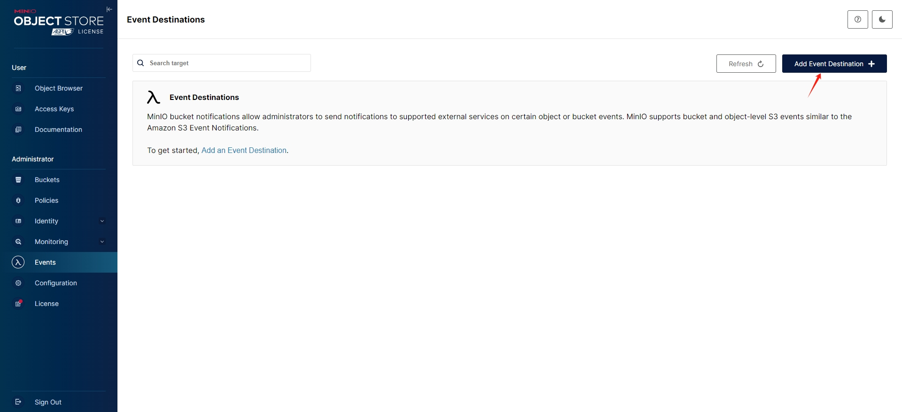
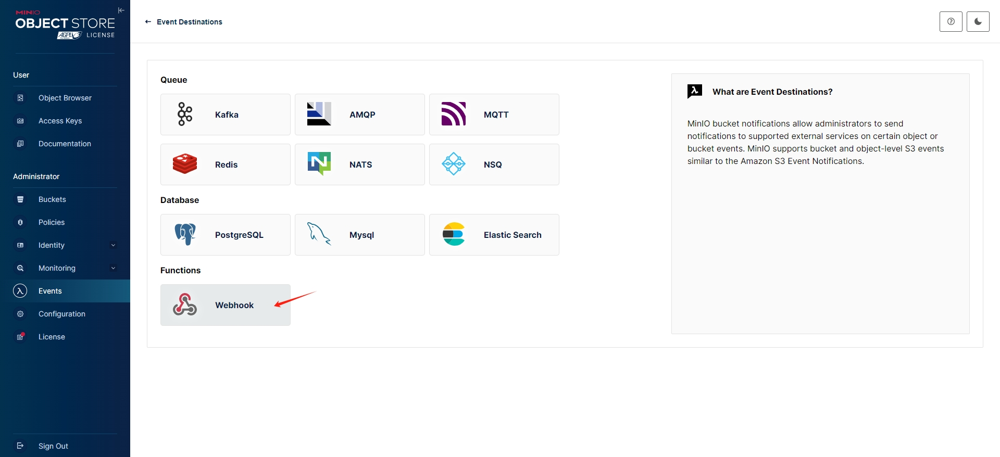
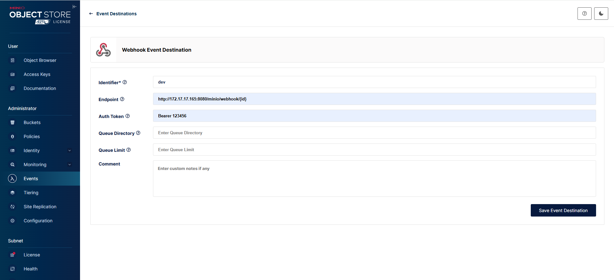
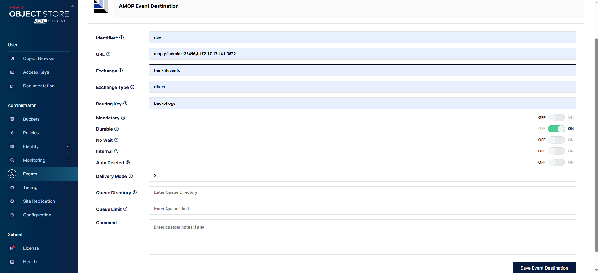
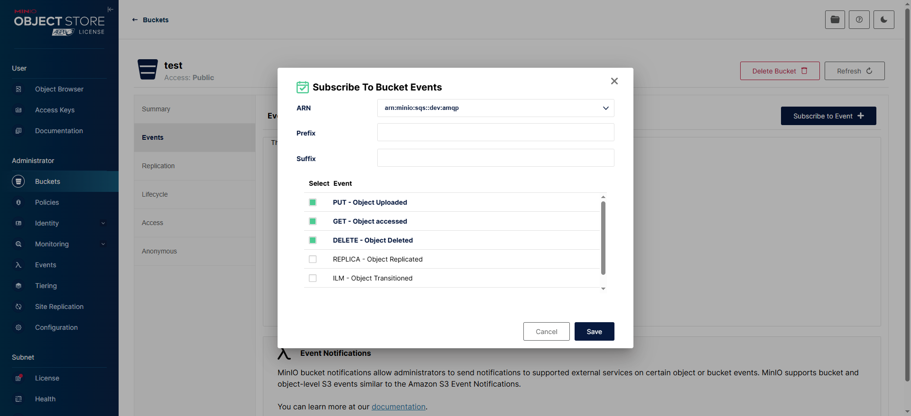

# MinIO使用Webhook和AMPQ实现上传回调

**MinIO 库**：使用自建/多平台存储，或追求轻量级、灵活的客户端。

**AWS SDK**：项目深度依赖 AWS，或需使用 S3 独有功能

- 查询信息：http://172.17.17.165:8080/oss/info?fileName=1743488658933.jpg
- 下载地址：http://172.17.17.165:8080/oss/url?fileName=1743488658933.jpg
- 下载：http://172.17.17.165:8080/oss/download?fileName=1743488658933.jpg
- 删除：http://172.17.17.165:8080/oss/?fileName=1743488658933.jpg

```bash
docker run -dit -p 9000:9000 -p 9001:9001 --name minio \
  -v /data/minio/data:/data \
  -v /data/minio/config:/root/.minio \
  minio/minio server /data --console-address ":9001"
```

访问地址：http://172.17.17.160:9001/ ，账户密码：minioadmin/minioadmin

创建事件

创建Webhook

填写回调地址

创建AMPQ

绑定桶


> AMPQ创建回调后，默认没有将交换机与队列进行绑定，绑定过程是在项目代码中完成。