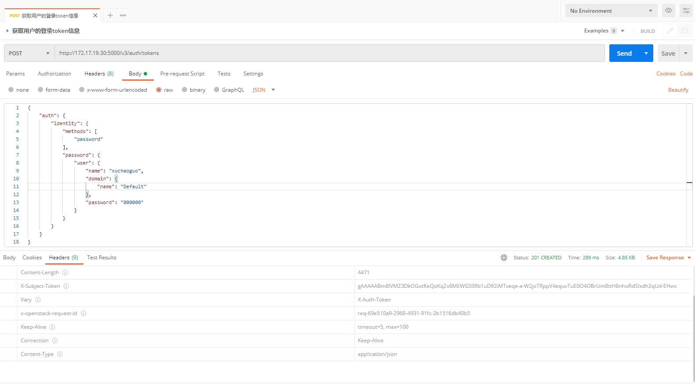
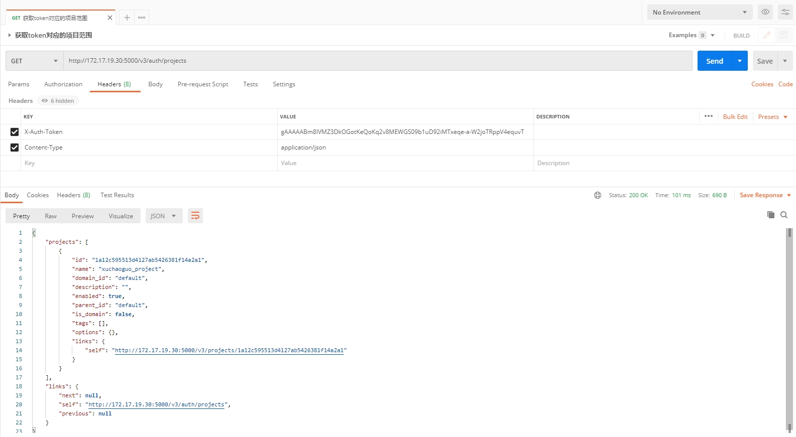
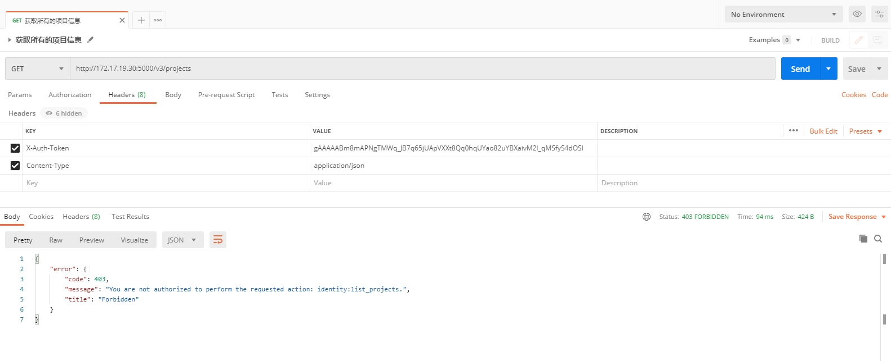
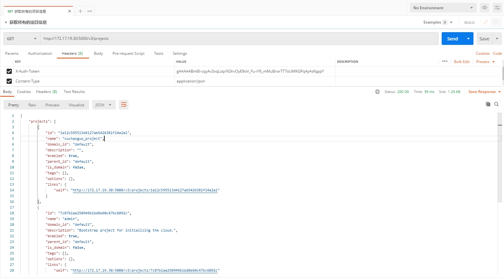

# OpenStack4j

## Identity鉴权服务的API使用

### 概述

​	Identity 服务生成允许访问 OpenStack 服务 REST API 的身份验证令牌。客户端通过向身份验证服务提供其有效凭据来获取此令牌和其他服务 API 的 URL 端点。

​	每次向 OpenStack 服务发出 REST API 请求时，都会在 X-Auth-Token 请求标头中提供身份验证令牌。与大多数 OpenStack 项目一样，OpenStack Identity 通过基于基于角色的访问控制 (RBAC) 方法定义策略规则来保护其 API。

### 错误响应码对应的原因

Bad Request (400) 身份服务未能按预期解析请求。发生以下错误之一：
- 缺少必需的属性。
- 指定了不允许的属性，例如基本 CRUD 操作中 POST 请求的 ID。
- 指定了意外数据类型的属性。

Unauthorized (401) 发生以下错误之一：
- 未执行身份验证。
- 指定的X-Auth-Token标头无效。
- 身份验证凭据无效。
- 并非所有 MFA 规则都得到满足。
- 指定的Openstack-Auth-Receipt标头无效。

Forbidden (403) 身份已成功通过身份验证，但无权执行请求的操作。

Not Found (404) 操作失败，因为无法通过 ID 找到引用的实体。对于 POST 请求，引用的实体可能在请求正文中而不是在资源路径中指定。

Conflict (409) POST 或 PATCH 操作失败。例如，客户端尝试更新实体的唯一属性，该属性与同一集合中的另一个实体的属性冲突。或者，客户端对具有用户定义的唯一属性的集合发出两次创建操作。例如，客户端/users为用户实体的唯一的、用户定义的名称属性发出了两次POST 请求。

### 获取用户的登录token信息

访问地址： http://192.168.2.200:5000/v3/auth/tokens

需要传入如下的参数，可以看到是设置验证方式是密码，设置用户名，密码，domain名称：

```
{
    "auth": {
        "identity": {
            "methods": [
                "password"
            ],
            "password": {
                "user": {
                    "name": "admin",
                    "domain": {
                        "name": "Default"
                    },
                    "password": "secret"
                }
            }
        }
    }
}
```



查看返回的response消息的header，得到该用户的token信息：

```
X-Subject-Token gAAAAABm8lIJqkqWsIeEVfrz2w2n8Ox55X70_lzGiijdFNkDPmadPjOSC6EXSQwFLilVBeug5cJSNEFMf1Q_uTMi-iCMOvyIKTSnFgRX-QMaNXklp4xw-7OAl7g1srXNUZPz_xAZWC2icStocUGnew2IXwWm1IkPMg
```

### 获取token对应的项目范围

此调用返回可根据请求中提供的 X-Auth-Token 确定范围的项目列表。响应的结构与为用户列出项目完全相同

访问地址： http://192.168.2.200:5000/v3/auth/projects




### 获取所有的项目信息

访问地址： http://192.168.2.200:5000/v3/projects



系统返回403错误，因为没有访问的权限

```
{
    "error": {
        "code": 403,
        "message": "You are not authorized to perform the requested action: identity:list_projects.",
        "title": "Forbidden"
    }
}
```

### 解决403报错问题

使用admin用户访问某些请求时会出现如下的错误：

```
{"error": {"message": "You are not authorized to perform the requested action: identity:list_users", "code": 403, "title": "Forbidden"}}
```

可能是admin用户没有最大权限，尝试为admin用户添加project和role

```
root@controller:~# source /etc/keystone/admin-openrc.sh
root@controller:~# openstack user show admin
+---------------------+----------------------------------+
| Field               | Value                            |
+---------------------+----------------------------------+
| domain_id           | default                          |
| enabled             | True                             |
| id                  | 51fa1bf86b0f4c148eb5291d6d51510d |
| name                | admin                            |
| options             | {}                               |
| password_expires_at | None                             |
+---------------------+----------------------------------+
root@controller:~# openstack user set --project admin admin
root@controller:~# openstack role add --project admin --user admin admin
root@controller:~# openstack user show admin
+---------------------+----------------------------------+
| Field               | Value                            |
+---------------------+----------------------------------+
| default_project_id  | 7c07b1aa250949b1bd8e60c47bc6092c |
| domain_id           | default                          |
| enabled             | True                             |
| id                  | 51fa1bf86b0f4c148eb5291d6d51510d |
| name                | admin                            |
| options             | {}                               |
| password_expires_at | None                             |
+---------------------+----------------------------------+
```

再次查询，看到将所有的项目信息查询出来了

