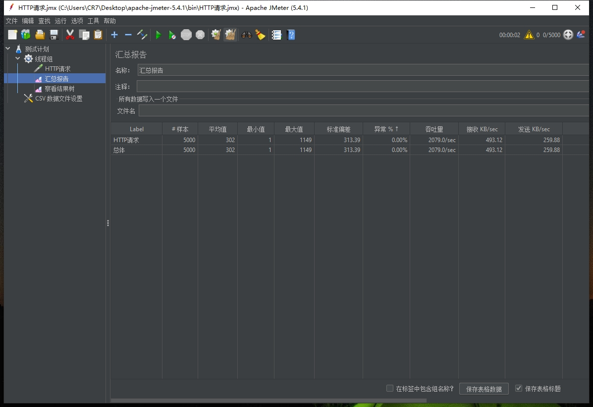

# pg百万性能查询调优


## 1. 创建表

```sql
drop table test;
create table test as (
	select
		generate_series ( 1, 1000000 ) ID,
		date ( generate_series ( now( ), now( ) + '52 week', '100 day' ) ) create_time,
		substring ( md5( random( ) :: varchar ), 2, 8 ) :: varchar vid,
	( random( ) * 10000 ) :: numeric ( 5 ) play 
	);
```

创建索引
```bash
create index test_idx on test ("id");
```

## 2. 测试结果



```bash
mvn clean compile
mvn clean package
```