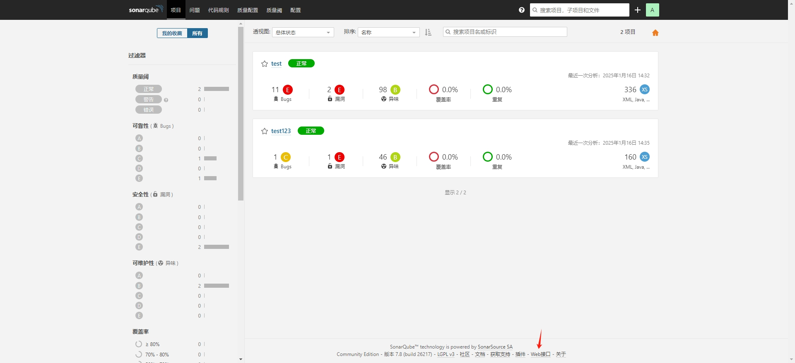
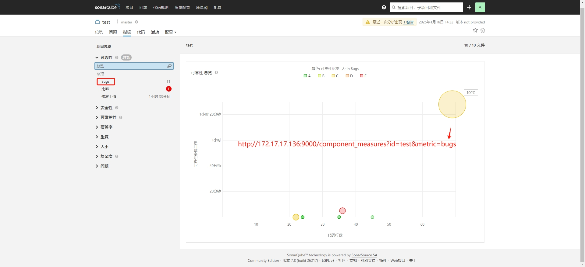

# SonarQube 7.8 Community Edition

SonarQube的Web API是一组HTTP REST API，允许开发人员与SonarQube服务器进行交互。这些API涵盖了SonarQube的各个方面，包括项目管理、问题管理、质量规则和指标等.

## 接口列表



## 指标明细




## 编译构建

```bash
mvn clean compile
mvn clean package
```