# 微信开发

## 一. 公众号网页授权

申请测试微信公众号：https://mp.weixin.qq.com/debug/cgi-bin/sandboxinfo?action=showinfo&t=sandbox/index

### 1. 配置安全域名

域名不能带端口号，备案通过同时上传验证文件txt

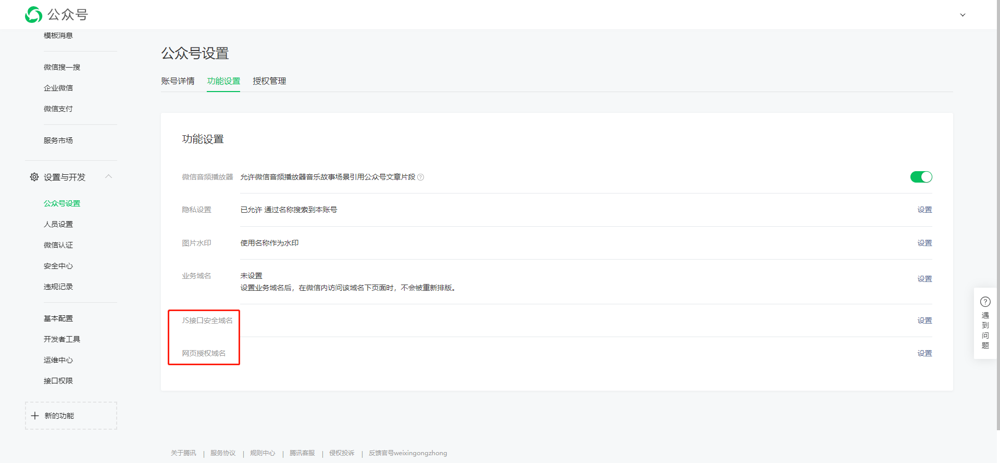

### 2. 添加网页授权

### 3. 开发者配置

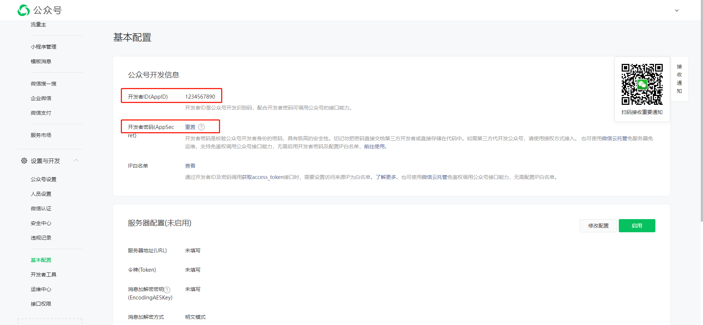

### 4. 网页授权流程
[1 第一步：用户同意授权，获取code](https://developers.weixin.qq.com/doc/offiaccount/OA_Web_Apps/Wechat_webpage_authorization.html#0)

[2 第二步：通过 code 换取网页授权access_token](https://developers.weixin.qq.com/doc/offiaccount/OA_Web_Apps/Wechat_webpage_authorization.html#1)

[3 第三步：刷新access_token（如果需要）](https://developers.weixin.qq.com/doc/offiaccount/OA_Web_Apps/Wechat_webpage_authorization.html#2)

[4 第四步：拉取用户信息(需 scope 为 snsapi_userinfo)](https://developers.weixin.qq.com/doc/offiaccount/OA_Web_Apps/Wechat_webpage_authorization.html#3)

[5 附：检验授权凭证（access_token）是否有效](https://developers.weixin.qq.com/doc/offiaccount/OA_Web_Apps/Wechat_webpage_authorization.html#4)

### 5. 访问地址

https://digpm.vjsp.cn/cms/index

> 开发者工具无法收到消息，只能使用真机测试

## 二. 公众号发送消息

### 1. 设置类目与模板

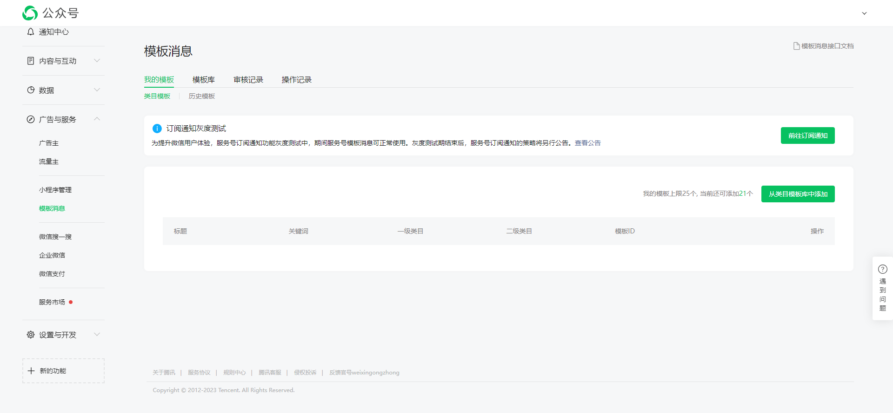

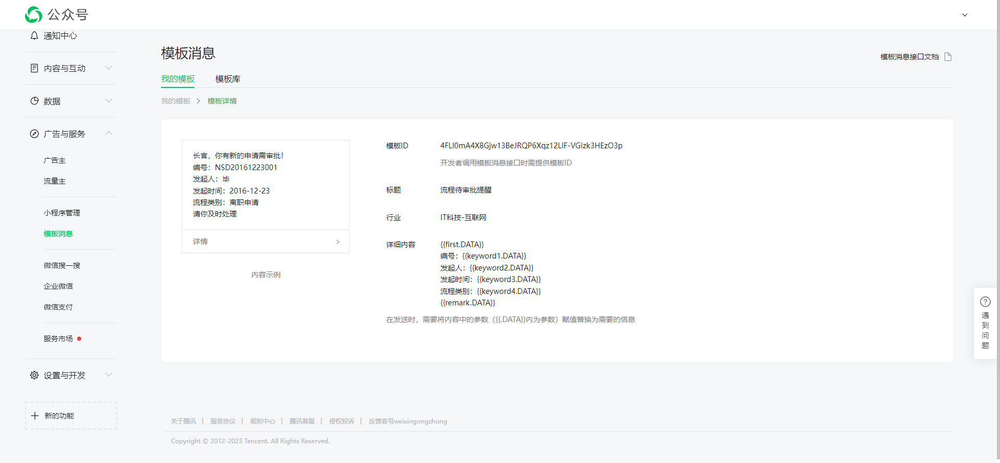

### 2. 模板消息接口

https://developers.weixin.qq.com/doc/offiaccount/Message_Management/Template_Message_Interface.html

### 3. 文本消息接口

https://developers.weixin.qq.com/doc/offiaccount/Message_Management/Service_Center_messages.html#%E5%AE%A2%E6%9C%8D%E6%8E%A5%E5%8F%A3-%E5%8F%91%E6%B6%88%E6%81%AF

## 三. 分享

### 1. 设置安全域名

### 2. 引入JS

http://res.wx.qq.com/open/js/jweixin-1.6.0.js

### 3. 说明文档

https://developers.weixin.qq.com/doc/offiaccount/OA_Web_Apps/JS-SDK.html

### 4. 分享

### 5. 上传图片

## 四. 企业微信扫码

注册企业微信：https://work.weixin.qq.com/wework_admin/register_wx?from=myhome

### 1. 注册

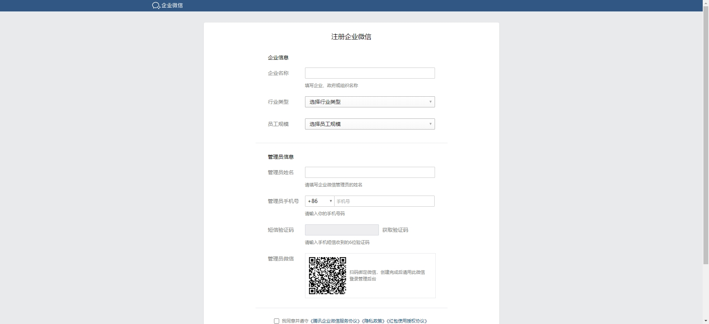

### 2. 创建应用

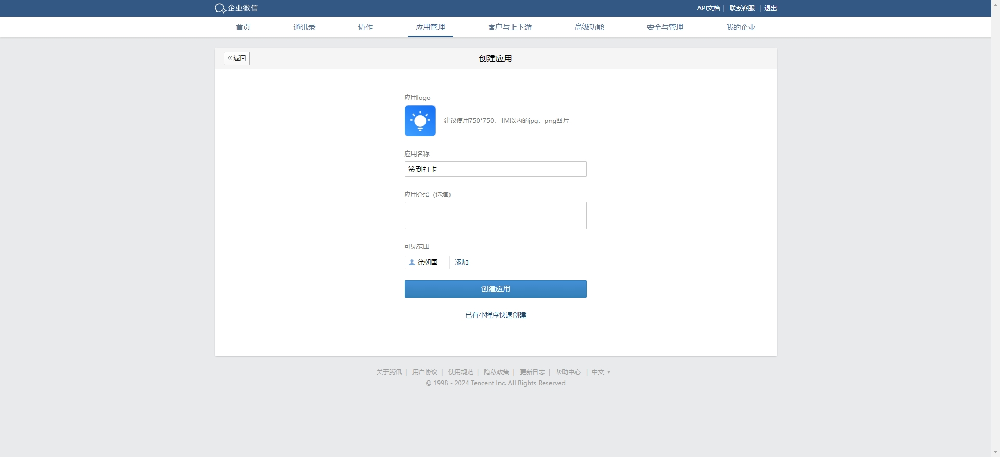

### 3. 企业微信授权登录

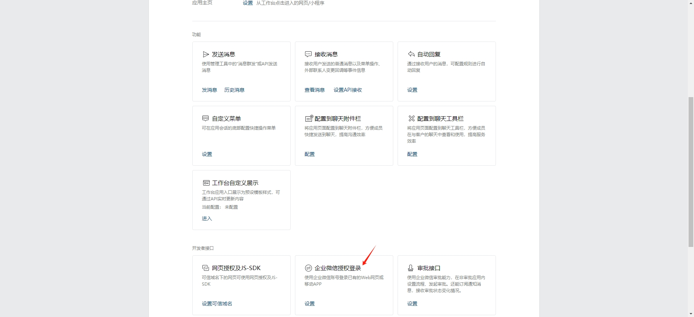

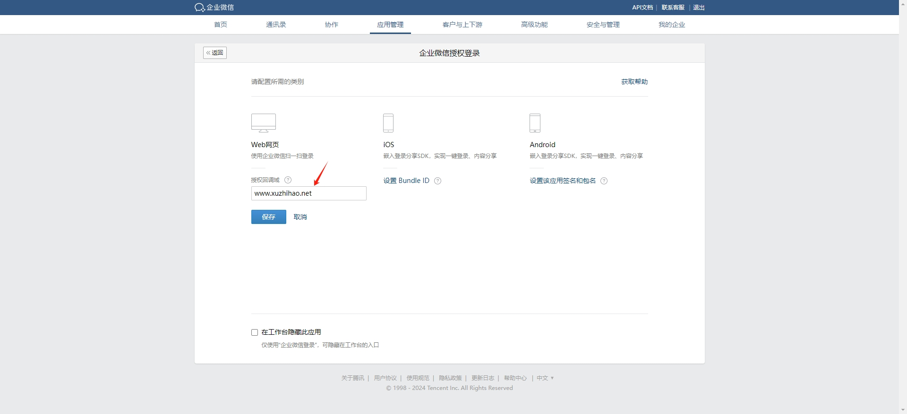

### 4. 网页授权及JS-SDK

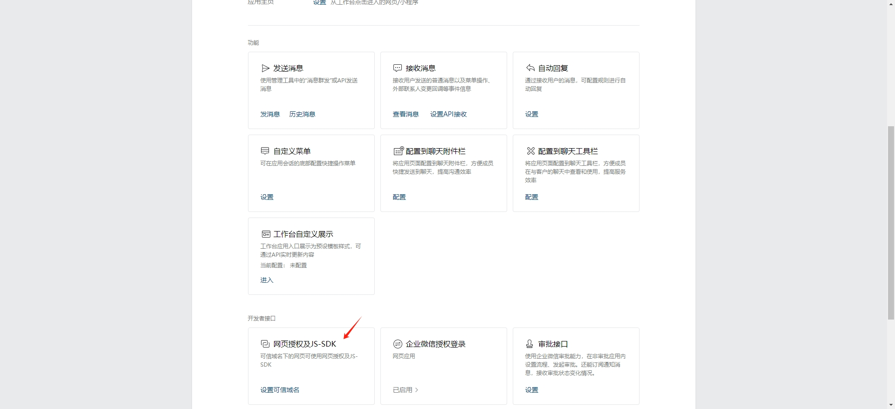

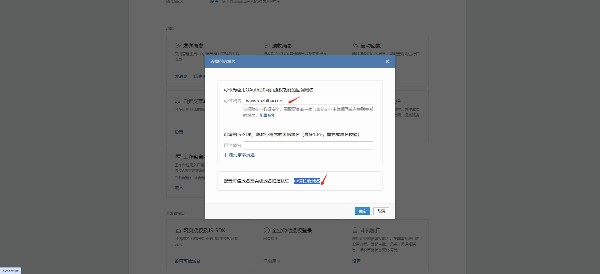

### 5. 企业可信IP

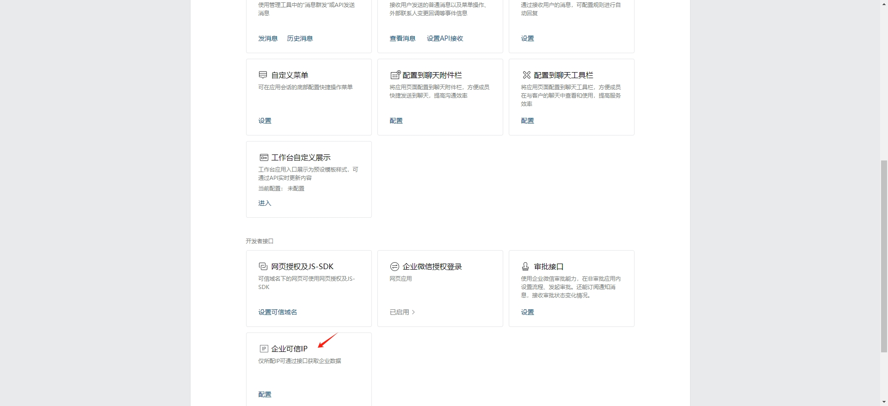

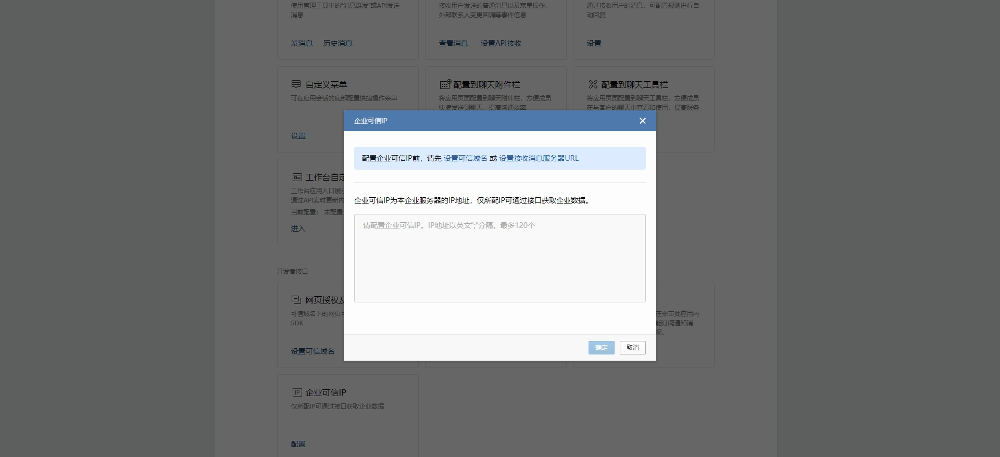

### 6. 设置可见范围并记录密钥

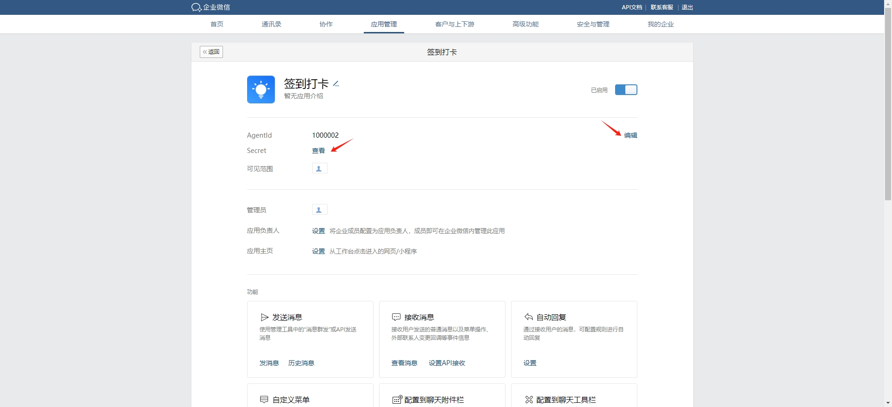